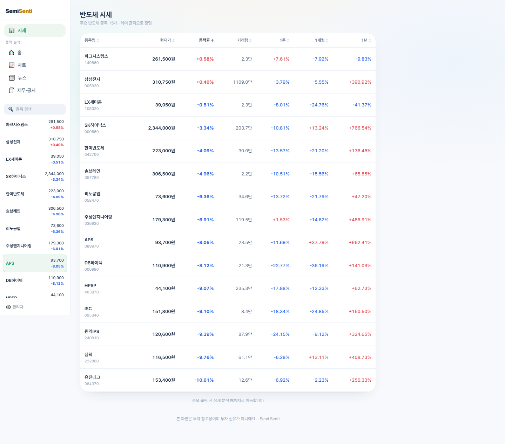
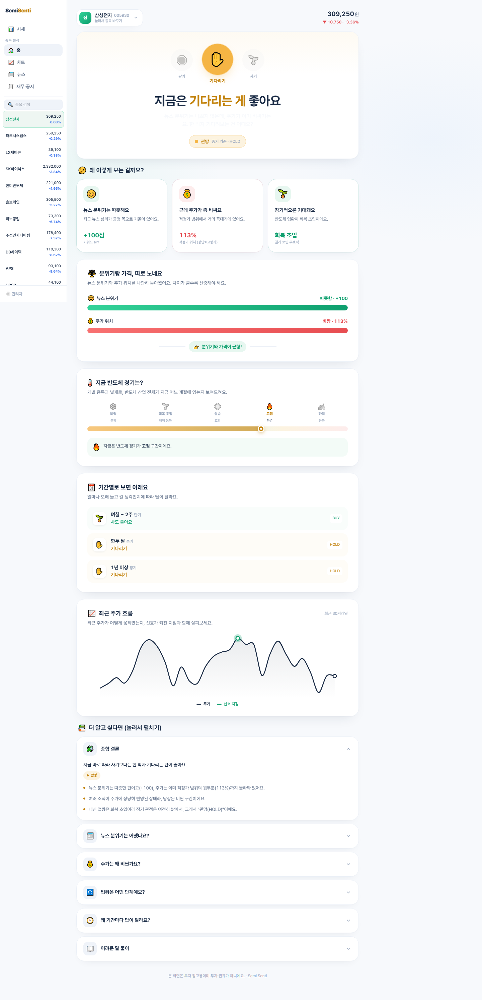
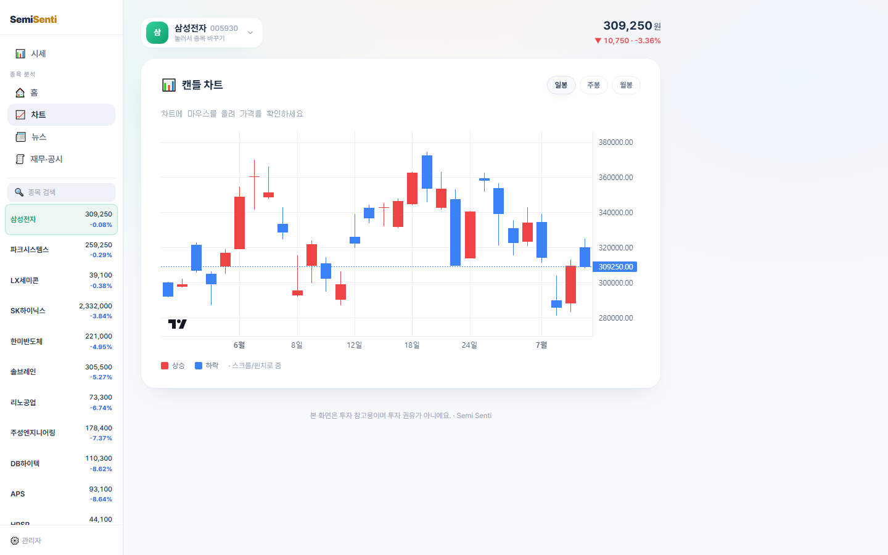
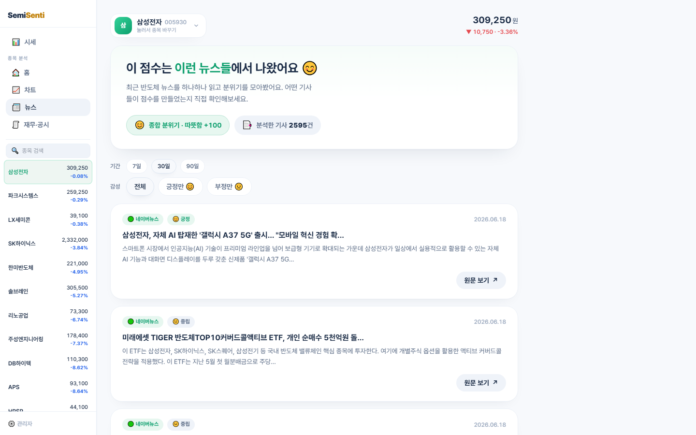
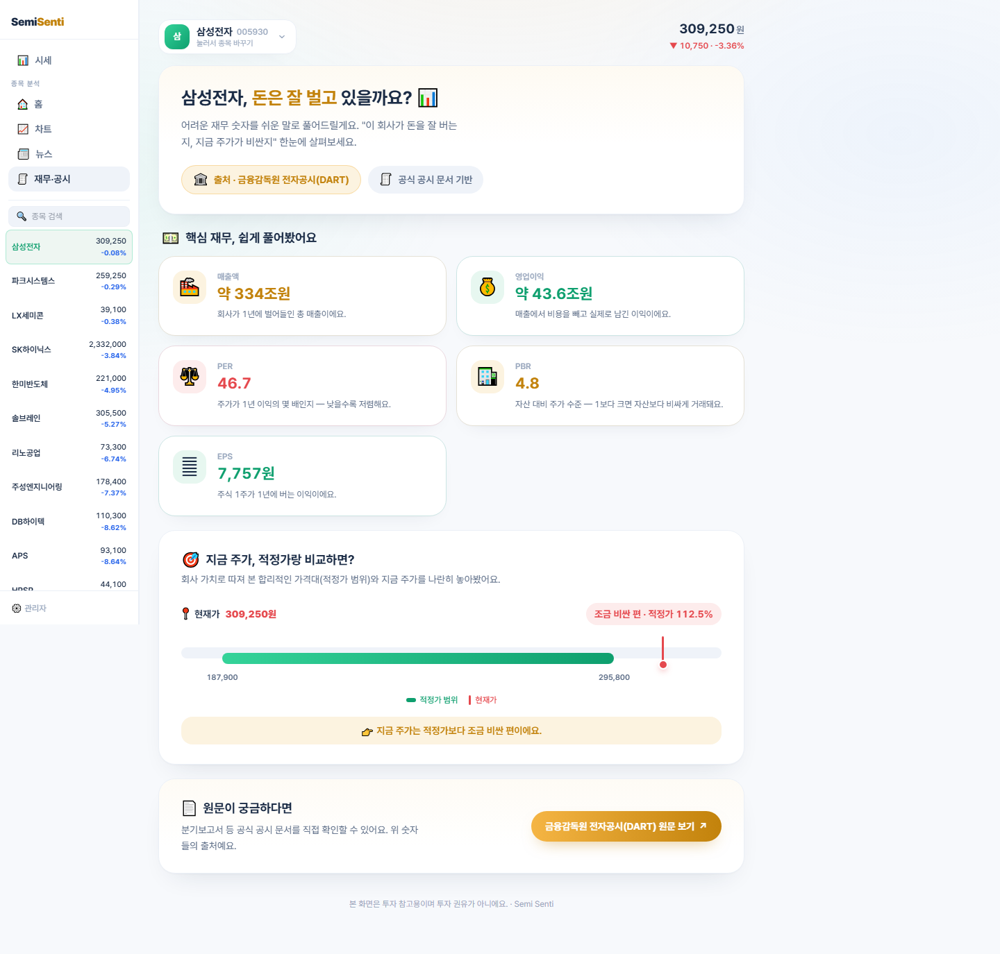
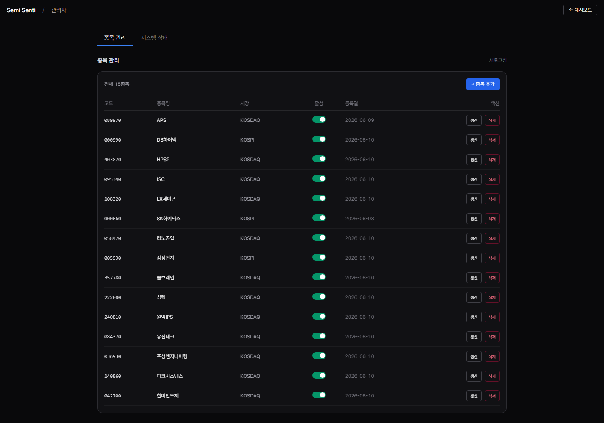
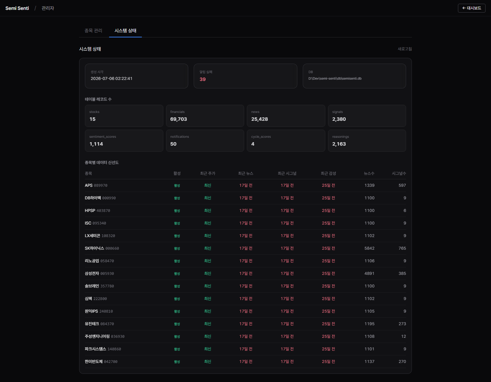

# Semi Senti — 기능 비주얼 워크스루

실제 앱을 구동해 **Playwright로 캡처한 화면**과 기능 설명입니다.
(백엔드 `:8001` + 프론트 `:3000` 기동 후 각 화면을 순회하며 캡처. 데이터는 실제 수집분 15종목.)

나레이션·자막 대본은 [`narration.md`](narration.md) 및 [`srt/`](srt) 를 참고하세요.

---

## 1. 스크리너 — 반도체 종목 한눈에

주요 반도체 종목 15개를 **현재가·등락률·거래량·1주·1개월·1년 수익률**로 나열합니다.
상승은 빨강, 하락은 파랑. **헤더 클릭으로 정렬**(재클릭 시 오름/내림 토글), 종목 클릭 시 상세 분석으로 이동합니다.

---

## 2. 홈 — 신호등 대시보드

**신호등**(사기🌱·기다리기✋·팔기🛑)이 중기 관점 판단을 한눈에 보여주고, 헤드라인으로 결론을 요약합니다("지금은 기다리는 게 좋아요").
아래로 **근거 3카드**(뉴스 분위기 점수·적정가 대비 주가 위치·업황 국면), **분위기 vs 가격 비교 막대**, **반도체 사이클 바**(바닥→회복→상승→고점→하락), **단·중·장기 관점별 판단**, **최근 30거래일 종가 + 신호 지점**, 그리고 펼침형 **근거 아코디언**과 **AI 해설**이 이어집니다.

---

## 3. 차트 — 캔들차트

**일봉·주봉·월봉** 전환이 가능한 캔들차트입니다. 상승 빨강 / 하락 파랑, 마우스 오버 시 시·고·저·종가 툴팁, 휠 확대·드래그 이동을 지원합니다.

---

## 4. 뉴스 — 기사 + 감성 분위기

상단 배너에 **종합 분위기 점수**와 분석 기사 수가 표시되고, **기간(7·30·90일)·감성(전체/긍정/부정) 필터**로 좁혀 볼 수 있습니다.
각 카드에는 출처, **긍정😊·부정😟·중립😐 배지**, 시각, 제목·요약, 키워드, 원문 링크가 담깁니다.

---

## 5. 재무 — 실적·밸류에이션

**DART 공시** 기반으로 **매출액·영업이익·PER·PBR·EPS** 카드를 쉬운 설명과 함께 보여주고, **적정가 밴드**로 현재가가 적정 구간의 어디쯤인지(비싼지/적정한지) 알려줍니다.

---

## 6. 관리자 — 종목 관리

코드·종목명·시장·활성 여부를 표로 관리합니다. **종목 추가**, **활성 토글**, **갱신**(시그널·감성·사이클 재계산), **삭제**가 가능합니다.

---

## 7. 관리자 — 시스템 상태 & 데이터 신선도

테이블별 **레코드 수**와 종목마다 **주가·뉴스·시그널·감성 데이터가 얼마나 최신인지**를 배지로 보여줘, 데이터 수집 상태를 한 화면에서 점검할 수 있습니다.

---

> 캡처 방법: `python -m semi_senti.api` (백엔드) + `cd web && npm run dev` (프론트) 기동 후,
> Playwright(headless)로 각 뷰를 순회하며 `docs/demo/screenshots/*.png` 로 저장.
